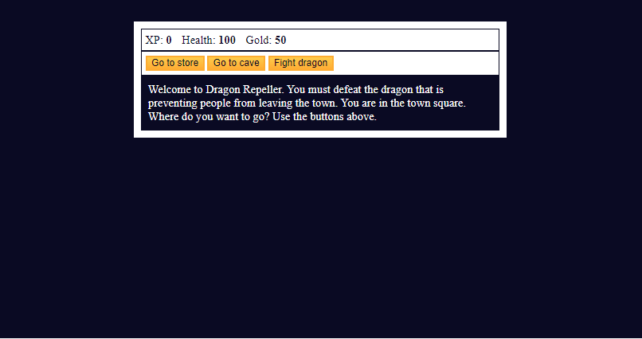

<h1 align="center"> JavaScript Role Playing Game </h1>

 

  

## 🚀 Technologies

This project was developed with this technologies:

- HTML
- JS 

## 💻 Project

Use of arrays, strings, objects, functions, loops, if/else statements to constroy a game board.

---

No Copyright :wave: by https://www.freecodecamp.org

- [access the finished project, online](https://rodrigocccesar.github.io/role_playing_game)

